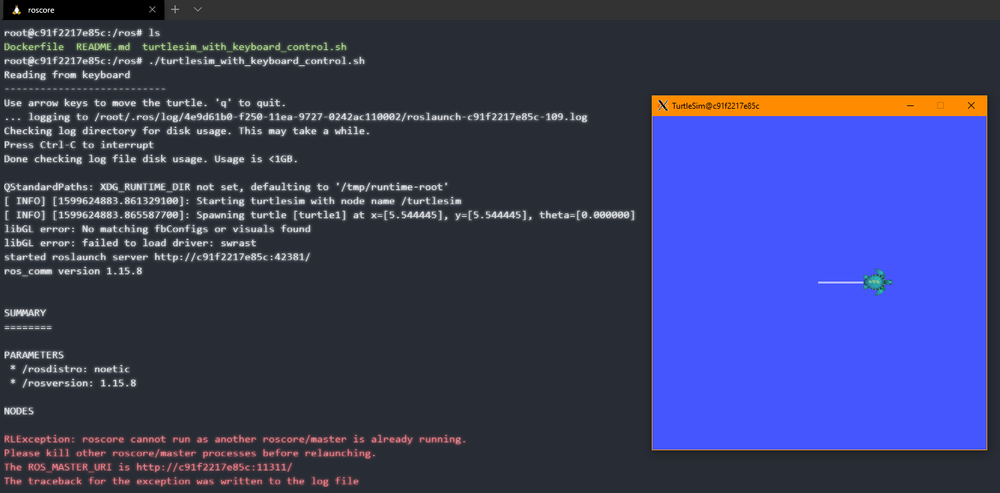

# Working with ROS using Docker

Utilizing the official [Docker](https://hub.docker.com/_/ros) images to run ROS Docker containers.

   

## DEPENDENCIES

[Ubuntu Windows Subsystem for Linux 2](https://docs.microsoft.com/en-us/windows/wsl/install-win10)

[Docker for WSL2](https://docs.docker.com/docker-for-windows/wsl/)

## Using GUI with ROS Docker Containers:
[GUI SUPPORT ON LINUX](http://wiki.ros.org/docker/Tutorials/GUI)

[GUI SUPPORT ON WINDOWS](https://techcommunity.microsoft.com/t5/windows-dev-appconsult/running-wsl-gui-apps-on-windows-10/ba-p/1493242)

## HOW TO RUN

### On Windows
Make sure your windows build supports WSL2 and Docker (see dependencies) and install them.

Follow [this guide](https://techcommunity.microsoft.com/t5/windows-dev-appconsult/running-wsl-gui-apps-on-windows-10/ba-p/1493242) to get xserver running on Windows 10 to be able to use GUIs.

Using WSL2 Ubuntu command line, build the image:
1. `cd /PATH/TO/ros`
2. `docker build -t ros-image .`

Start a container with the image you just built in interactive mode:
1. start container: `docker run -it --env="DISPLAY" --privileged --volume="$(pwd):/ros" --name=ros_container ros-image`
2. start roscore in the background: `roscore &`
3. start turtlesim node: `rosrun turtlesim turtlesim_node` 

Using the scripts:
* Replace step 4 with (change to the ros folder, give the script permission, and finally run it) Probably need to run it twice due to same GUI issue as bove: `cd ros && chmod +x turtlesim_with_keyboard.sh && ./turtlesim_with_keyboard_control.sh`

Publish topics from command line example:
* `rostopic pub -r 10 /turtle1/cmd_vel geometry_msgs/Twist '{linear:  {x: 0.1, y: 0.0, z: 0.0}, angular: {x: 0.0,y: 0.0,z: 0.0}}'
`

### On Ubuntu

Build image using the Docker in command line: 
1. `cd /PATH/TO/ros`
2. `docker build -t ros-image .`

Start a container with the image you just built in interactive mode:
1. give permissions: `xhost + local:root`
2. start container: `docker run -it --env="DISPLAY" --privileged --volume="/tmp/.X11-unix:/tmp/.X11-unix:rw" --volume="$(pwd):/ros" --name=ros_container ros-image`
3. start roscore in the background: `roscore &`
4. start turtlesim node: `rosrun turtlesim turtlesim_node` (you probably have to run this twice as the first time the GUI is blakc screen)
5. take away permissions when you're done: `xhost - local:root`

Using the scripts:
* Replace step 4 with (change to the ros folder, give the script permission, and finally run it) Probably need to run it twice due to same GUI issue as bove: `cd ros && chmod +x turtlesim_with_keyboard.sh && ./turtlesim_with_keyboard_control.sh`

Publish topics from command line example:
* `rostopic pub -r 10 /turtle1/cmd_vel geometry_msgs/Twist '{linear:  {x: 0.1, y: 0.0, z: 0.0}, angular: {x: 0.0,y: 0.0,z: 0.0}}'
`
